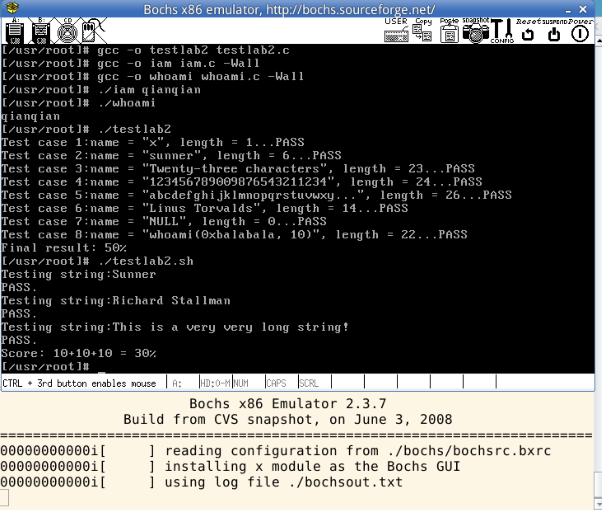

# HIT-Linux0.11-lab-1and2

* 哈工大操作系统实验系列连载：</br>
    * [本篇 lab1 lab2](https://github.com/wwyqianqian/HIT-Linux0.11-lab-1and2)
    * [lab3](https://github.com/wwyqianqian/HIT-Linux0.11-lab3)

### lab1

* 改写 `bootsect.s` 主要完成如下功能：[实现代码](https://github.com/wwyqianqian/HIT-Linux0.11-lab/commit/0b35a50474be0b159b4e6dd597f01982dcf2e181)
  * bootsect.s 能在屏幕上打印一段提示信息“XXX is booting...”，其中 XXX 是你给自己的操作系统起的名字，例如 LZJos、Sunix 等。
  * Run
    ```
    $ cd ~/oslab/linux-0.11/boot/
    $ as86 -0 -a -o bootsect.o bootsect.s
    $ ld86 -0 -s -o bootsect bootsect.o
    $ dd bs=1 if=bootsect of=Image skip=32
    $ cp ./Image ../Image
    $ ../../run
    ```

* 改写 `setup.s` 主要完成如下功能：[实现代码](https://github.com/wwyqianqian/HIT-Linux0.11-lab/commit/5edbd1ae8d5a98e16c56839dcb435766fb5242bd)
  * bootsect.s 能完成 setup.s 的载入，并跳转到 setup.s 开始地址执行。而 setup.s 向屏幕输出一行"Now we are in SETUP"。
  * setup.s 能获取至少一个基本的硬件参数（如内存参数、显卡参数、硬盘参数等），将其存放在内存的特定地址，并输出到屏幕上。
  * setup.s 不再加载 Linux 内核，保持上述信息显示在屏幕上即可。
  * Run
  ```
	$ cd ~/oslab/linux-0.11
	$ make BootImage
	$ ../run
  ```

* 运行截图
    
---

### lab2

此次实验的基本内容是：在 Linux 0.11 上添加两个系统调用，并编写两个简单的应用程序测试它们。[本地实现代码](https://github.com/wwyqianqian/HIT-Linux0.11-lab/commit/f98e098ea1240143072c074a5f96df89aba8d69f) [挂载后 bochs 完整环境代码](https://github.com/wwyqianqian/HIT-Linux0.11-lab/commit/ac0b788e0d878ee2370a797666bffecad6a66e42)

* `iam()`

	第一个系统调用是 iam()，其原型为：
	```
	int iam(const char * name);
	```

	完成的功能是将字符串参数 `name` 的内容拷贝到内核中保存下来。要求 `name` 的长度不能超过 23 个字符。返回值是拷贝的字符数。如果 `name` 的字符个数超过了 23，则返回 “-1”，并置 errno 为 EINVAL。 </br>
	在 `kernal/who.c` 中实现此系统调用。

* `whoami()`

  第二个系统调用是 whoami()，其原型为：

  ```
  int whoami(char* name, unsigned int size);
  ```

  它将内核中由 `iam()` 保存的名字拷贝到 name 指向的用户地址空间中，同时确保不会对 `name` 越界访存（`name` 的大小由 `size` 说明）。返回值是拷贝的字符数。如果 `size` 小于需要的空间，则返回“-1”，并置 errno 为 EINVAL。也是在 `kernal/who.c` 中实现。

* 编译内核 挂载虚拟机
```
$ cd linux-0.11
$ make all
$ cd ..
$ sudo ./mount-hdc
$ cp linux-0.11/include/unistd.h hdc/usr/include
$ cp linux-0.11/include/linux/sys.h hdc/usr/include/linux
$ vim hdc/usr/root/iam.c
$ vim hdc/usr/root/whoami.c
$ sudo umount hdc
$ ./run
```

* 测试程序

运行添加过新系统调用的 Linux 0.11，在其环境下编写两个测试程序 iam.c 和 whoami.c。最终的运行结果是：
```
$ gcc -o testlab2 testlab2.c
$ gcc -o iam iam.c -Wall
$ gcc -o whoami whoami.c -Wall
$ ./iam qianqian
$ ./whoami
qianqian
$ ./testlab2.c
$ ./testlab2.sh
```

* 取消挂载后测试截图
  

---

